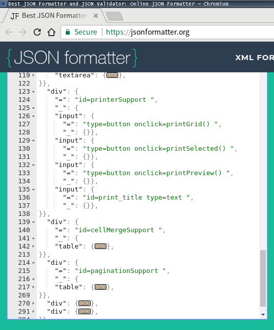

# {{.Name}}

{{render "license/shields" . "License" "MIT"}}
{{template "badge/godoc" .}}
{{template "badge/goreport" .}}
{{template "badge/travis" .}}

## {{toc 5}}

## {{.Name}} - HTML Extraction Tool

The `htmlextract` makes it easy to look at the HTML files from different aspects. 

- **`htmlextract outline`** will extract HTML structure as outline so as to focus more easily on the structure, not the details.
- **`htmlextract clean`** will clean up HTML tags & attributes as much as possible, so as to go back to the plain text version as easy as possible. 
- **`htmlextract h2md`** will convert HTML to .md file on top of above clean up.

# Usage

### $ {{exec "htmlextract" | color "sh"}}

### $ {{shell "htmlextract outline" | color "sh"}}

### $ {{shell "htmlextract clean" | color "sh"}}

### $ {{shell "htmlextract h2md" | color "sh"}}


# Examples

## Outline

### $ {{shell "htmlextract outline -i test/sample0.html -o" | color "json"}}

### Advantages

- By extracting HTML structure as outline, the `htmlextract outline` will make it easier to analyse the file structure, by eliminating all the glory details out of the way, which is most often needed when doing web scrapping or WebDriver code developing.
- The output is mindfully chosen as the JSON format so as to easily take advantage of the dynamic folding feature that the text editors provide. Or you can use the [jsonformatter.org](https://jsonformatter.org/) online as well, even without a text editor.

Here is a screenshot of viewing the result of `htmlextract outline -i test/sample2.html`:



# Download binaries

- The latest binary executables are available under  
https://github.com/go-xmlfmt/{{.Name}}/releases  
as the result of the Continuous-Integration process.
- I.e., they are built right from the source code during every git tagging commit automatically by [travis-ci](https://travis-ci.org/).
- Pick & choose the binary executable that suits your OS and its architecture. E.g., for Linux, it would most probably be the `{{.Name}}_linux_VER_amd64` file. If your OS and its architecture is not available in the download list, please let me know and I'll add it.
- You may want to rename it to a shorter name instead, e.g., `{{.Name}}`, after downloading it. 


# Debian package

Available at the above releases url as well.

# Install Source

To install the source code instead:

```
go get github.com/go-xmlfmt/htmlextract
```


## Author(s) & Contributor(s)

- [Antonio SUN](https://github.com/AntonioSun)

_Powered by_ [**WireFrame**](https://github.com/go-easygen/wireframe), the _one-stop wire-framing solution_ for Go cli based projects, from start to deploy.

All patches welcome. 
